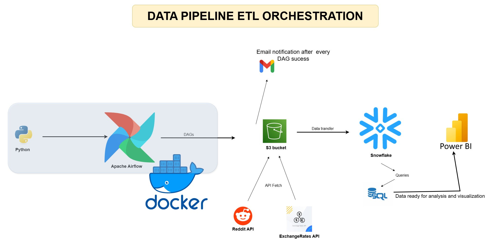
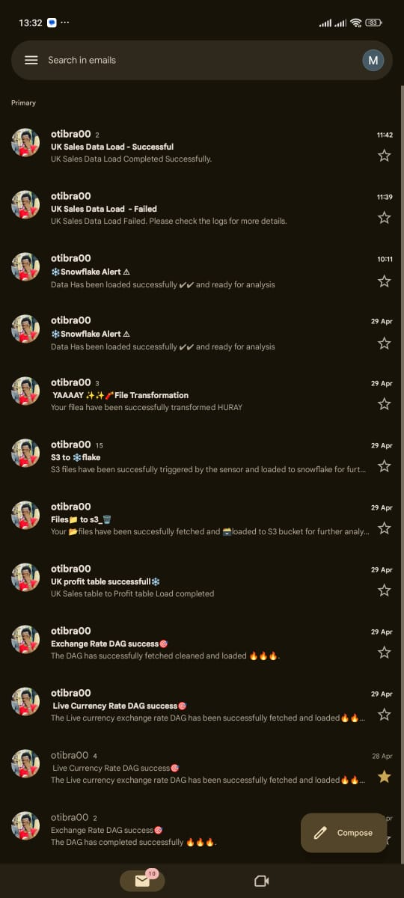

# 🌬️ Airflow Data Engineering Pipeline Project

This repository contains a complete Data Engineering pipeline using **Apache Airflow**, designed to demonstrate scheduling, orchestration, data ingestion, transformation, and inter-task communication.


## 🚀 Project Overview 📘

### 📌 Objective
Automate a data pipeline that:
- Loads and transforms FX and product data from **Amazon S3** to **Snowflake**
- Handles scheduling, conditional branching, task retries, and dataset dependencies
- Demonstrates Airflow features like **XComs**, **Trigger Rules**, **Hooks**, and **Custom Operators**


## 🧰 Tools & Technologies Used

| Tool / Tech        | Purpose                                           |
|--------------------|---------------------------------------------------|
| **Apache Airflow** | Workflow orchestration and scheduling             |
| **Snowflake**      | Cloud data warehouse (final data store)           |
| **Amazon S3**      | Raw data storage (landing zone)                   |
| **Python**         | Data processing logic, Airflow DAGs               |
| **Docker**         | Containerized Airflow environment                 |
| **SQL**            | Data transformations in Snowflake                 |
| **VS Code**        | IDE for development                               |


## 🏗️ Project Structure

```
airflow/
├── dags/
│   ├── conditional_branching.py
│   ├── data_process.py
│   ├── fx_data_consumer.py
│   ├── hybrid_dec.py
│   ├── latest_only.py
│   ├── taskflow_dec.py
│   ├── trigger_rule.py
│   └── xrate_to_s3.py
├── plugins/
│   ├── email_operator.py
│   └── email_trigger.py
├── sqls/
│   ├── profit_uk.sql
│   ├── xrate_sf.sql
│   └── live_exchange_rate.sql
├── docker-compose.yml
├── requirements.txt
└── .env

```
## 📌 Architecture



## 🔄 Key Concepts Demonstrated

- **TaskFlow API** and **traditional DAG styles**
- `@task` decorator for cleaner Python logic
- **Trigger Rules**: `all_success`, `one_failed`, `all_done`, etc.
- **XComs**: Passing data between tasks
- **Branching** with `BranchPythonOperator`
- **Hooks**: Custom and built-in integrations
- **Custom Operators** in the `plugins/` folder
- **LatestOnlyOperator**: Prevents historical backfill
- Loading into Snowflake with `external_stage` and `LATERAL FLATTEN`

---

## 🧪 Example Workflow

1. Data is ingested from S3 (CSV/JSON)
2. Scheduled DAGs manage data ingestion and transformation
3. Branching logic based on file type or conditions
4. Data is transformed and loaded into Snowflake
5. Email notification sent via custom operator

## 📌 Eamails Notifications from DAGs


---


## 🐳 Run Locally with Docker

### 🧱 Prerequisites:
- Docker + Docker Compose installed
- Access Airflow UI: [http://localhost:8080](http://localhost:8080)
- Default login: `airflow / airflow`

---

## 📬 Outputs

- Transformed data in Snowflake
- Logs and audit trails in Airflow
- Intermediate files handled via `/tmp` and S3

---

## 🔗 Summary

> 🚀 Built a complete data pipeline using Apache Airflow with S3, Snowflake, and Python.  
> 🧩 Integrated XComs, Branching, Trigger Rules, Hooks, and Custom Operators.  
> 🐳 Containerized with Docker for reproducible workflows.  
> 📊 Loaded and transformed FX and product data into Snowflake using modern ETL architecture.  
> 🎯 Emphasized reliability, modularity, and clean orchestration logic.

---

## 🙌 Acknowledgments

- Inspired by modern medallion architecture practices
- Referenced official docs: [Apache Airflow Documentation](https://airflow.apache.org/docs/)

- ## 🛡️ License

This project is licensed under the [MIT License](LICENSE). You are free to use, modify, and share this project with proper attribution.


[](https://dev.to/brian_otina_)
[](https://github.com/otinabrayo)
[](mailto:brianotina20@gmail.com)
[](https://t.me/just_otina)
[](https://discord.com/channels/@otina_)

```
